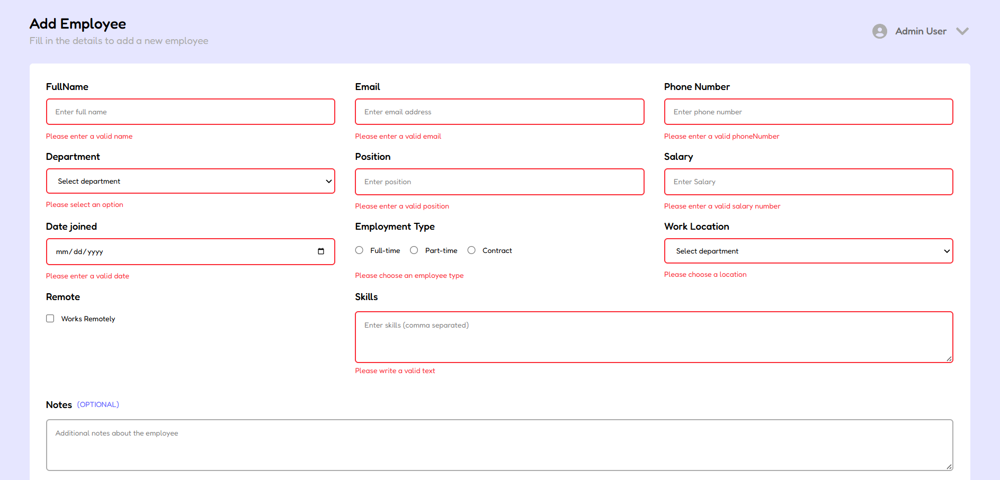

# Employee Management Form


A modern and responsive employee management form built with **React**, **TypeScript**, and **Tailwind CSS**. This
project demonstrates best practices for form handling, validation, reusable components, and state management in React
applications.

---

## Preview

### Desktop View


## Errors view



### Mobile View


---

## Features

* Responsive employee registration form
* Built with React and TypeScript
* Reusable UI components
* Controlled form inputs
* Field validation on blur
* Full form validation on submit
* Error messages with user-friendly feedback
* Form reset functionality
* Type-safe state management
* Clean and scalable project structure

---

## Tech Stack

* React
* TypeScript
* Tailwind CSS
* Vite
* React Icons

---

## Validation Rules

The form validates:

* Full Name
* Email Address
* Phone Number
* Department Selection
* Position
* Salary
* Join Date
* Employment Type
* Work Location
* Skills

Validation utilities include:

```text id="t8lcg9"
isNotEmpty()
isEmail()
isPhoneNumber()
hasMinLength()
isPositiveNumber()
isSelected()
```

---

## Project Structure

```text id="xfh9k8"
src/
├── components/
│   ├── EmployeeForm/
│   ├── Input.tsx
│   ├── Selector.tsx
│   ├── Radio.tsx
│   ├── Checkbox.tsx
│   ├── TextArea.tsx
│   └── Button.tsx
│
├── types/
│   └── employeeFormTypes.ts
│
├── utils/
│   └── validateFn.ts
│
├── App.tsx
└── main.tsx
```

---

## Getting Started

### Clone the Repository

```bash id="e65xk9"
git clone https://github.com/your-username/employee-management-form.git
```

### Navigate to the Project

```bash id="bndk5n"
cd employee-management-form
```

### Install Dependencies

```bash id="4we90m"
npm install
```

### Start Development Server

```bash id="hajvry"
npm run dev
```

### Build for Production

```bash id="2af0yj"
npm run build
```

---

## Learning Goals

This project was created to practice:

* React state management
* Controlled components
* Form validation patterns
* TypeScript with React
* Reusable component architecture
* Tailwind CSS styling
* User experience improvements for forms

---

## Future Improvements

* Backend integration
* Employee data persistence
* Edit and delete employee records
* Search and filtering
* React Hook Form integration
* Zod schema validation
* Toast notifications
* Unit and integration tests
* Dark mode

---

## Author

Created by **Massomeh Sh** as part of a React and TypeScript learning journey.

---

## License

This project is licensed under the MIT License.
